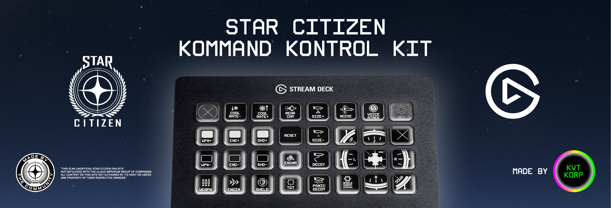

# SCK3 — Star Citizen Kommand Kontrol Kit for Stream Deck



> **Unofficial fan project.** Not affiliated with, endorsed by, or sponsored by Cloud Imperium Games or Roberts Space Industries. Star Citizen® is a registered trademark of Cloud Imperium Rights LLC. See [ACKNOWLEDGEMENTS.md](ACKNOWLEDGEMENTS.md) for the full disclaimer and credits.

Star Citizen has over 1,000 bindable actions spread across ships, on-foot combat, mining, trading, and more — far more than any keyboard shortcut can keep at your fingertips. SCK3 puts that entire action space on your Elgato Stream Deck. Since Star Citizen exposes no official game API, SCK3 reads the game's own keybind configuration directly, so every button on your deck stays in sync with your actual in-game binds — no manual re-mapping, no drift between game and deck.

## Demo

<iframe width="560" height="315" src="https://www.youtube.com/embed/BITfzvxfX8Q?si=Ydb2gYuReuVeGECY" title="YouTube video player" frameborder="0" allow="accelerometer; autoplay; clipboard-write; encrypted-media; gyroscope; picture-in-picture; web-share" referrerpolicy="strict-origin-when-cross-origin" allowfullscreen></iframe>

## Features

- **Keybind Auto-Fill** — reads Star Citizen's full action list and your current keybinds, then generates a complete profile and writes it straight to `actionmaps.xml`.
- **Channel Indicator** — shows which Star Citizen channel (LIVE, PTU, EPTU) is currently active on your key face, and lets you cycle between installed channels with a press.
- **Open Logs** — one-press access to the plugin's log folder, for troubleshooting.

Pair it with KVT Korp's SCK3 profiles and icon packs for a plug-and-play deck built for the verse.

## Support

If SCK3 saves you time in the verse, consider chipping in to keep development going:

- **Ko-fi:** [ko-fi.com/kvtkorp](https://ko-fi.com/kvtkorp/)
- **PayPal:** [paypal.com/donate](https://www.paypal.com/donate/?hosted_button_id=T5HXDLL8ULBXN)
- **Stripe:** [donate.stripe.com](https://donate.stripe.com/14A5kDchz5s60eEcRy9sk00)

## Community

Join the official **KVT Korp** Discord for support, news, discussions, and updates: [discord.gg/krWnxzWGfp](https://discord.gg/krWnxzWGfp)

## Requirements

- [Elgato Stream Deck app](https://www.elgato.com/downloads) 7.1 or later
- Windows 10 or later
- Star Citizen installed (LIVE, PTU, or EPTU)

## Installation

This project is currently in **alpha (0.1.0)**. Grab the latest `.streamDeckPlugin` file from the [Releases](https://github.com/korneliusvontastik/sck3-sd-plugin/releases) page and double-click it to install — Stream Deck will handle the rest.

Also available on the [Elgato Marketplace](https://marketplace.elgato.com/@kvtkorp).

## Development

See [CLAUDE.md](CLAUDE.md) for the full command reference (build, watch, test, package) and repo structure. In short, everything runs from `sck3/`:

```bash
cd sck3
npm install
npm run watch
```

Further technical background lives in [docs/](docs/): the Star Citizen keybind system ([docs/keybinds.md](docs/keybinds.md)), SC runtime discovery & I/O ([docs/sc-runtime.md](docs/sc-runtime.md)), and plugin architecture ([docs/architecture.md](docs/architecture.md)).

## License

[MIT](LICENSE)

## Acknowledgements

This plugin builds on the work of prior Star Citizen Stream Deck creators and reverse-engineering efforts. Full credits and the trademark disclaimer are in [ACKNOWLEDGEMENTS.md](ACKNOWLEDGEMENTS.md).

<a href="https://robertsspaceindustries.com/community-hub"></a>
